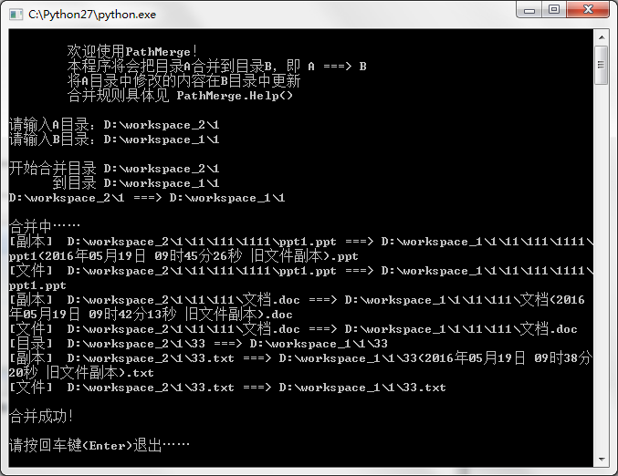

# PathMerge - 目录合并小工具
## 前言
这个程序是我做毕设的时期写的，每次去机房拷贝毕设文件到电脑，一天过后再把修改后的文件一个一个拷贝回来，覆盖，东西一多，我就不知道到底那些文件修改过了，哪些没有修改过，所以有时候辛苦了一天的文件，结果忘了复制到优盘里带走，第二天系统自动还原找不到了，实在让我很心累……**（应用场景）**

于是我就写了这个小工具，它能合并目录，并自动检测修改的文件，在合并目录的时候创建旧文件的副本，拷贝新文件过来，如此，合并目录也不会丢失文件。**（作用）**

提供exe可执行文件发布器**py2exe.py**，可将python文件干净的转换为exe可执行文件。

需配合PyInstaller使用，请自行下载，详情见：[使用pyInstaller发布PathMerge的exe版本（py转换成exe）](http://www.cnblogs.com/yym2013/p/5509263.html)

该项目中我已经给出了转换之后的.exe文件，没有python环境的可以**直接运行PathMerge.exe**使用。

## 使用演示
现在有两个工作空间


工作空间1是你之前做好的一个工程或者文件夹，里面放满了文件，目录结构复杂。


详细目录：


工作空间2是你现在要工作的目录，现在是空的。


我们把要用的文件夹拷过来


并在里面做一些改动。

这里不放图了，总之我创建了一个文件夹，创建了两个文件，修改了三个文件……现在目录结构变成这样：


和之前不同了，可以看到，新目录中1/下多了一个文件夹33，33/中多了两个文件111.txt和222.txt，我还修改了一个txt文件，一个ppt文件和一个word文件的内容。具体的就不贴图了。

下面运行PathMerge开始合并：


输入A目录（修改的文件夹）和B目录（原文件夹），要将A==>B，A合并到B。


回车开始合并：



合并成功！

合并的记录都列在上面了，如果名称相同的文件会将旧文件创建一个副本，修改后的文件直接复制过去，程序中没有删除文件的代码，可放心食用。

上图可知复制了三个文件，创建了三个旧文件副本，另外复制了创建的目录。

将工作空间2中1文件做的所有改动都包含了进去。

说的有点啰嗦，其实使用很简单，如果你嫌每次输入目录太麻烦的话，你也可以将命令写入脚本，每次双击运行即可。

## 特性
* 可识别加“”的目录和不加“”的目录。

* 使用**MD5**识别文件是否修改。
MD5识别文件的内容见博文：[python计算文件的md5值](http://www.cnblogs.com/yym2013/p/5482796.html)

* 支持命令行执行，可用来写脚本。例：

脚本目录：


脚本内容：


* 原文件夹内的旧文件不会被删除，而是创建一个带有时间戳的副本。修改过的新文件直接复制过去。
 这样不用担心合并之后文件莫名其妙的丢失，使用该工具**不会有文件删除操作**。

* 列出合并记录，统计合并信息


## 快速安装

### step 1 : 直接clone到本地

```
git clone https://github.com/windcode/PathMerge.git
```

### step 2 : 进入目录执行 PathMerge.py

```
python PathMerge.py
```

ps：直接运行PathMerge.exe也是可以的

## 注意
* 测试环境为windows
